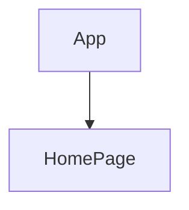

# 💻 PROJECT NAME ✨ => 💻  Travelopia-assign
> 
 

## 🔗 Profile Links✨

| Resume | Github                                                                                                                                   | Linkedin                                                                                                                                                            | Portfolio                                                                                                                                    | Blogger                                                                                                                                                           | Medium                                                                                                                                    |
| ------------- | ---------------------------------------------------------------------------------------------------------------------------------------- | ------------------------------------------------------------------------------------------------------------------------------------------------------------------- | -------------------------------------------------------------------------------------------------------------------------------------------- | -------------------------------------------------------------------------------------------------------------------------------------------- | -------------------------------------------------------------------------------------------------------------------------------------------- |
|  | |  | | | |  

## 💫Tech-Stack->

- #### For Frontend:-
   - `HTML5`
   - `CSS3`
   - `JavaScript `
      
- #### For live Project: -
   - `Vercel`
   
---
## ⭕About project:

# Armenia Tours Website

💻 Welcome to the Armenia Tours website! This project showcases a responsive website for a travel company offering tours to Armenia. Explore the rich cultural and natural environment of this beautiful destination. It is a layout page built with HTML, CSS, and JavaScript. It includes a responsive design to provide a great user experience on all desktop, tablet and mobile devices. The website features a "Show More/Show Less" button to toggle the visibility of detailed descriptions.

## Features

- Responsive design for various screen sizes (desktop, tablet, and mobile).
- Simple hamburger menu for mobile screens.
- Image carousels highlighting trust factors and key offerings.
- Interactive "Show More/Show Less" button for detailed tour descriptions.
- Static Design webpage with one functionality.
- Optimization for performance and Core Web Vitals.

## Getting Started

### Prerequisites

Ensure you have the following software installed on your machine:

- A modern web browser (e.g., Google Chrome, Firefox)
- Text editor (e.g., Visual Studio Code, Sublime Text)

### Installation

1. Clone the repository:
   git clone https://github.com/shikhu51197/Travelopia-assign.git

2. Install the required dependencies:
npm install

✨Open the project in your text editor.
✨Start a local development server or open the index.html file in your browser.

# Usage

💫Responsive navbar and homepage.
💫Test the responsiveness on various devices.
💫Interact with the "Show More/Show Less" button to toggle tour descriptions.

# Optimizations

The code has been optimized for performance by implementing the following:

⭕Lazy loading for images.
⭕Minified CSS and JavaScript for reduced file sizes.
⭕Setting explicit width and height for images to improve CLS.
⭕Asynchronous loading of non-critical JavaScript.
⭕Critical CSS is inlined for faster initial rendering.

# Website Performance and Metrics
The website was tested in Pagespeed Insights-https://pagespeed.web.dev/

---

## Flow

---

<h1 align="center">✨Thank You✨</h1>
